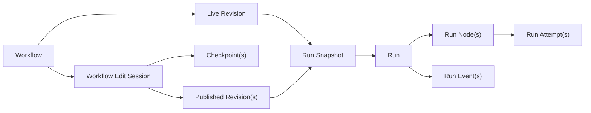

# Design Note: Graph-First Workflows and Runtime

## Status

- Status: Draft for implementation planning
- Date: 2026-03-06
- Related PRD: [PRD.agentic-workflows-and-automation.md](/Users/polarzero/code/projects/origin/docs/drafts/PRD.agentic-workflows-and-automation.md)

## Purpose

This note translates the workflow PRD into an implementation-facing product contract. It does not define exact database schemas or API payloads, but it does lock the runtime objects, visibility rules, navigation model, and execution invariants tightly enough to support a concrete implementation phase.

## Why This Note Exists

The existing workflow direction in earlier phases is still session-first:

- Phase `06` models workflows mainly as YAML-authored trigger + steps + library references.
- Phase `07` models a run as one top-level execution session.
- Phase `09` models run visibility mainly through history rows and session deep links.

That is no longer sufficient. The graph-first workflow redesign needs a stable conceptual contract before implementation work starts.

## Product Contract

### Workflow

The live YAML definition plus any workflow-local resource files.

### Workflow Revision

An immutable saved authored state of a workflow. A workflow has one live revision at a time.

### Workflow Edit Session

A session linked to exactly one workflow for authoring or refinement. It can create multiple checkpoints and may publish multiple live revisions over time.

### Checkpoint

A session-local recovery or compare point. A checkpoint is nested inside one workflow edit session and is not a top-level history row.

### Run Snapshot

The immutable fully resolved execution input for a run. It freezes:

- the source workflow revision
- workflow-local resources
- exact shared-library content
- trigger metadata
- run input

### Run

One execution of one run snapshot plus one input.

### Run Node

One graph item instance inside a run. This includes user-authored nodes and system-generated nodes such as reconcile.

### Run Attempt

One try of one run node.

### Run Event

An ordered runtime event record used for auditability and advanced inspection.

### Run Frame

An advanced graph snapshot used for reconstruction and inspection. V1 should not assume that every scheduler tick must persist a full frame.

### Session Link

An explicit linkage object between a session and workflow/run/node context, including role and visibility policy.

## Design Doctrine

1. Keep the app overall session-first.
2. Make workflows graph-first inside dedicated workflow and run surfaces.
3. Keep the current top-level runtime objects such as `Run`, `Operation`, `Draft`, `IntegrationAttempt`, `DispatchAttempt`, and `AuditEvent`.
4. Insert a graph-execution layer underneath those objects instead of replacing them.
5. Reuse current session and detail surfaces where they fit, especially for transcripts, diffs, logs, and artifacts.

## Canonical Storage Model

### Source of Truth

The workflow file on disk is canonical. Graph edits, AI edits, and manual edits all converge on the same definition.

### Workflow-Local Resources

Workflow-local resources should live as sibling files owned by the workflow, not inline blobs inside the YAML.

### Shared Library Items

Shared library items stay in the global library and remain live dependencies for future runs. Old runs remain stable because the run snapshot freezes exact shared content.

## Revision, Checkpoint, and Snapshot Model

### Locked Decisions

- `save == live` in v1.
- One workflow edit session may publish multiple live revisions over time.
- Runs start from live revisions only in v1.
- Checkpoints remain internal to workflow edit history in v1.
- Past runs never adopt newer revisions or newer shared-library content.

## Session Role Model

### Roles

- `builder`
- `node_edit`
- `execution_node`
- `run_followup`

### Visibility

- `builder`: workflow-local by default, visible in workflow edit history and workflow surfaces.
- `node_edit`: workflow-local by default, visible from node detail and workflow edit history.
- `execution_node`: hidden from the global sidebar and opened from run node detail only.
- `run_followup`: persistent per run, visible from the run page, not from the global sidebar by default.

Workflow edit sessions are intent-scoped to one workflow, but they are not sandboxed to workflow files. History must surface when those sessions also changed unrelated workspace files.

### Important Constraint

Do not model these behaviors through `parent_id`.

Current app behavior ties `parent_id` to the wrong things for workflows:

- root-session sidebar loading in [session-load.ts](/Users/polarzero/code/projects/origin/packages/app/src/context/global-sync/session-load.ts)
- child-session notification suppression in [notification.tsx](/Users/polarzero/code/projects/origin/packages/app/src/context/notification.tsx)
- permission auto-respond lineage walking in [permission-auto-respond.ts](/Users/polarzero/code/projects/origin/packages/app/src/context/permission-auto-respond.ts)

Workflow semantics need explicit links and explicit visibility policy.

## Execution Status Model

### Top-Level Run

Keep the current top-level run lifecycle largely intact. The graph layer sits underneath it.

### V1 Node and Block Vocabulary

The graph model in v1 should support:

- `script`
- `agent_request`
- `condition`
- `parallel`
- `loop`
- `validation`
- `draft_action`
- `end`

### Run Node Status

Recommended vocabulary:

- `pending`
- `ready`
- `running`
- `succeeded`
- `failed`
- `skipped`
- `canceled`

### Run Attempt Status

Recommended vocabulary:

- `created`
- `running`
- `succeeded`
- `failed`
- `canceled`

### Important Transition

`Run Node: running -> ready`

This means the last attempt ended and the scheduler determined the node can try again. This avoids reopening a terminal node while still supporting deterministic retries and reconciliation.

### Skip Reasons Matter

Skip reasons should carry more meaning than additional statuses. Useful reasons include:

- `branch_not_taken`
- `downstream_invalidated`
- `loop_exit`
- `upstream_failed`
- `validation_failed`

## Block and System Node Semantics

### Branch

- container becomes `running` when the predicate begins
- non-selected paths become `skipped`
- selected path determines terminal outcome

### Parallel

- each branch runs from the same base snapshot in isolation
- each branch may mutate files
- block stays `running` while any branch is active
- implicit join happens at block end
- reconcile appears as a visible system node
- unresolved reconcile failure fails the block deterministically

### Loop

- loop is a visible container
- main graph should collapse iterations by default
- detail view can expand iteration history
- all loops are explicitly bounded in v1

### Validation

- validation is a first-class visible system node or block
- downstream dependents become skipped when validation fails

### Draft Action

- draft creation and send-related graph steps are visible workflow nodes where outbound rules allow them
- node detail should render payload, target, approval state, and send history

## Rerun Semantics

### Rerun Workflow

Always creates a new run from the current selected source and never mutates the old run.

### Rerun From Here

Always creates a new run linked to the source run and:

- reuses the same snapshot
- reuses the same input
- keeps valid upstream results
- invalidates downstream dependents
- recomputes from the selected failed node or block forward

## Navigation Model

### Primary Routes

- `/:dir/workflows/:workflowId`
- `/:dir/runs/:runId`
- `/:dir/library/:itemId`

The app may keep `/:dir/session/:id` as a primary route for normal chat usage.

### Workflow Detail

Default tab: `Design`

Tabs:

- `Design`
- `Runs`
- `Edit History`
- `Resources`

### Run Detail

Default view: summary + graph

Node detail should open in a side panel and be URL-addressable by query params such as:

- `node`
- `iteration`
- `attempt`
- `panel`

### Library Detail

Library item pages should expose:

- content/config
- `Used By`
- history

## History and Read Models

### Global History

Keep:

- `Runs`
- `Operations`
- `Drafts`

Add:

- `Workflow Edits`

### Workflow Edit History

- one top-level history row per workflow edit session
- checkpoints nested inside that row
- final graph/diff summary as the default view
- chat/checkpoint timeline as secondary detail

### Run Read Model

Primary run page should expose:

- run summary
- latest graph projection
- node status and summaries
- side effect summary
- follow-up chat entrypoint

Advanced inspectors should expose:

- attempts
- events
- raw logs
- raw transcripts
- artifacts

## Notifications and Deep Links

- completed and failed workflow run notifications should deep-link to run pages
- workflow edit notifications should deep-link to workflow pages
- no workflow execution feature should require a hidden child session as the primary navigation target

## Resource Policy

1. AI should inspect relevant shared library items before creating new resources.
2. AI may create workflow-local resources when reuse is not obvious.
3. AI may promote useful local resources into the shared library.
4. User edits to shared resources should surface `used by` and allow copy-on-write.
5. AI may directly edit shared library items when appropriate, but those impacts must be explicit in history.

## Reuse Strategy

The graph-first model should reuse the strongest existing surfaces:

- agent-node detail can reuse session/chat rendering
- script-node detail can reuse diff/log/output surfaces
- global history remains run/operation/draft-centric, but grows workflow-edit and node attribution instead of being replaced

## Implementation Recommendation: Run Frames

V1 should persist:

- run
- run node
- run attempt
- run event

V1 should not require a full persisted frame on every scheduler tick.

Recommended default:

- derive most graph frames on read
- persist milestone frames only if needed for recovery or advanced debugging

Likely milestone points:

- run start
- post-branch selection
- post-parallel join or reconcile
- rerun-from-here boundary
- terminal state

## Deferred Scope

Deferred scope remains tracked in [FUTURE_DESIGN_NOTES.md](/Users/polarzero/code/projects/origin/docs/drafts/FUTURE_DESIGN_NOTES.md), especially:

- pause/input nodes
- subworkflows
- runtime-generated nodes
- visual rule builders
- sandboxing
- richer run-frame persistence and export
